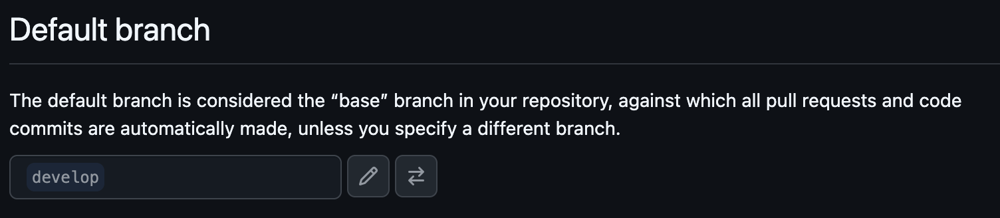
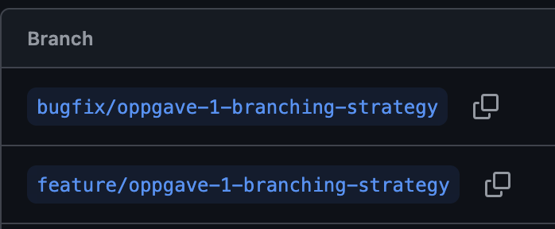
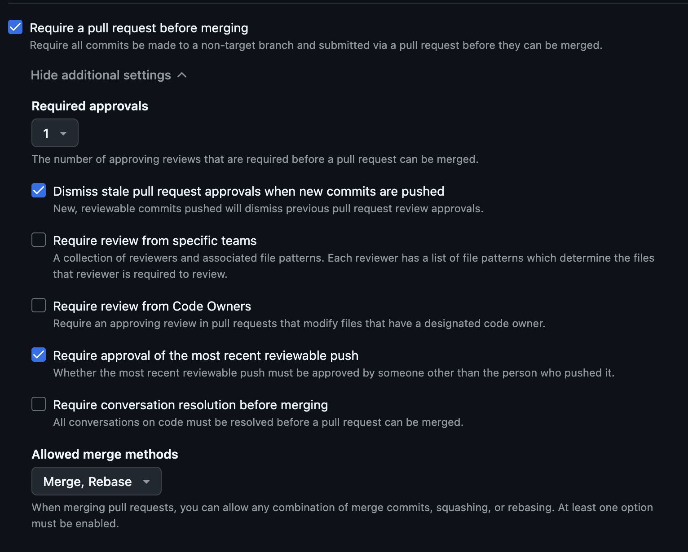
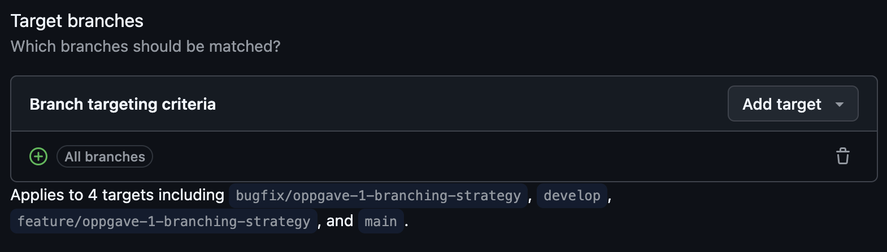
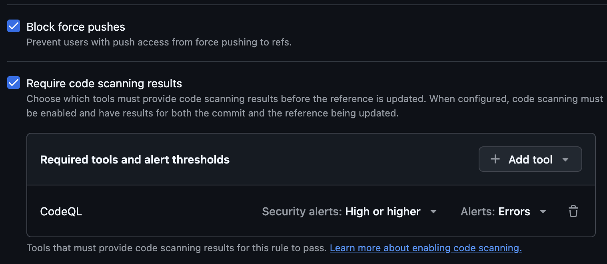

# Kontinuasjon-2026

## Notes on answers
I will keep to English in the answers as I have been working with English as my main professional language for the last 10 years.  
All screenshots are in the own section called [Screenshots](#screenshots)  
I might go a bit overboard with length and I apologize in advance for that.

## Oppgave 1:

### Branching strategy and naming
In a team of any size the branching strategy should be well defined.  
The strategy that I am most familiar with and that I think works well is the following:
 
<ul>
    <li>main
        <ul>
            <li>This is the main branch with the code that reflects the current deployment. </li>
            <li>Should only be merged into through merge requests going through the proper checks</li>
            <li>Usually tied to a pre-prod system through CI pipelines for testing by Q&A and automatic testing suite</li>
            <li>CI pipeline pushing to prod usually only done through manual action if no redundancy built in with several active servers</li>
            <li>If a multi-instance is running,usually this action is automatic depending on all previous steps are green and all checks passed</li>
        </ul>
    </li>
    <li>develop
        <ul>
            <li>This should be the default branch for the repo so that nothing is merged to prod by accident outside of CI pipeline</li>
            <li>Branch from which development branches are created</li>
            <li>Only merge into main from this branch (excluded hotfixes) by tech lead or assigned team member</li>
            <li>CI pipelines tied to an automatic deployment to a Demo environment</li>
        </ul>
    </li>
    <li>feature/ticket-number-keywords
        <ul>
            <li>Branches used for feature tickets</li>
            <li>Should always start with 'feature',  and then be followed by the ticket number from JIRA or a similar system</li>
            <li>Optional: adding keywords separated by '-'</li>
            <li>Ticket number in the branch name allows JIRA or another system to pick up the branch and add it to the ticket</li>
        </ul>
    </li>
    <li>bugfix/ticket-number-keywords
        <ul>
            <li>Branches used for tickets marked as bugs</li>
            <li>Should always start with 'bugfix',  and then be followed by the ticket number from JIRA or a similar system</li>
            <li>Optional: adding keywords separated by '-'</li>
            <li>Ticket number in the branch name allows JIRA or another system to pick up the branch and add it to the ticket</li>
        </ul>
    </li>
</ul>

### Pull Request Process

A pull request can be made as soon as a commit is done. Sometimes it's made as a 'Draft' request as soon as possible to get feedback from the Sonar scan and an early code review if requested.  
Usually a Pull Request is done when the development is done for a ticket and the time has come to merge it into the main development branch, in our case develop.  
 
When it comes to reviewing a request generally it's open for every member of the team with the required knowledge about the requirements of the ticket.  
I have also encountered teams where only the tech lead is allowed to review and merge Requests so it all comes down to what has been decided for the team in question.  
Also the number of approvals needed are dependent upon the guidelines in place for the team, minimum is one approval but often times two are needed where one of the approvals needs to be from a more senior member of the team.  
 
As to what needs to be in place before a Pull Request can be approved also depends on the stages in place.  
Usually these stages consists of, but are not limited to:
<ul>
    <li>Green build of project</li>
    <li>Code quality scanner is green</li>
    <li>Test suite is green</li>
    <li>Scanned for known security vulnerabilities including in dependencies</li>
    <li>Code review has been approved</li>
</ul>

### Main branch protection

The main branch should never be open for pushed code. 
All code changes to main branch have to be performed through Pull Requests that have gone through the same steps, or tougher, as the other branches. In addition it should be a designated person, or persons, responsible for these requests into main.
  
These rules are important because otherwise the project and the codebase will become messy quickly.  
If main or develop are open for simple code pushes then the probability or something going wrong is a lot higher since we have not applied the four-eye principle or any external tool that helps to ensure the quality of the code.  
Also an often overlooked aspects of code reviews is to make the entire team more familiar with the codebase and the changes that are made upon it. It's also an excellent forum for improving the technical skills of the team since someone generally has more in depth knowledge of a particular aspect that might have been touched upon.

### Automation

The absolute minimum of automation is to perform a build and test of the source code. Usuallt these are also paired with a quality scan and a security vulnerability scan  
Generally different steps have different requirements. 
What I find reasonable is the following: 
Upon any commit done, no matter in which branch, a pipeline should be triggered that does a build & test of the project.  
Upon creation of a Pull Request, we should have performed a build & test, as well as any security scans or code quality scans that have been configured for the project and that particular branch.  
A Pull Request cannot be merged until these steps are green. When the Pull Request is approved and merged then the previously defined steps should be run again since it's treated as a commit and they should all be run on each commit.  
In addition to the steps we've covered, on develop and main branch we can have a deployment step as well as a step for creating a tag if desired. The deployment step can be triggeren manually or automatically depending on the guidelines for the team.  
So in conclusion: all steps should be run on every commit where applicable (apart from deployment), so both before Pull Requests and afterwards on merge of the branch.

#### Screenshots

##### Default development branch

##### Example of feature and bugfix branches

##### Branch protection

##### Code Quality

